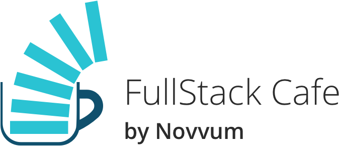

# FullStack Cafe ☕️

Welcome to FullStack Cafe's Repo Library!

> This repo contains resources, assets, and much more fun from FullStack Cafe!

### Resources

**2018**

- 11-30-2018 [Pathways](resources/2018/11-30-2018/README.md)
- 12-14-2018 [GraphQL vs REST](resources/2018/12-14-2018/README.md)

**2019**

- 01-11-19: [Vetting Open Source](resources/2019/1-11-2019/README.md)

### Assets

A collection of assets from FullStack Cafe

- [Logo Png](assets/logo.png)
- [Logo Svg](assets/logo.svg)
- [Full Logo Png](assets/fullLogo.png)
- [Full Logo Svg](assets/fullLogo.svg)

## Details

[Spectrum Chat](https://spectrum.chat/fullstack-cafe)
 
[Meetup Group](https://www.meetup.com/fullstackcafe/)
 
[Facebook Group](https://www.facebook.com/groups/fullstackcafe/)

What better way to share knowledge and build a community than over a cup of coffee? This is a group for anyone interested in software development, technology, consulting or the caffeine addicts like us. All skill levels are welcome. We started this group because as technologists ourselves, we are passionate learners who want to share and learn from like minded people. We look forward to meet all of you.

---

Made by <a href="https://www.novvum.io">Novvum</a> ❤️

