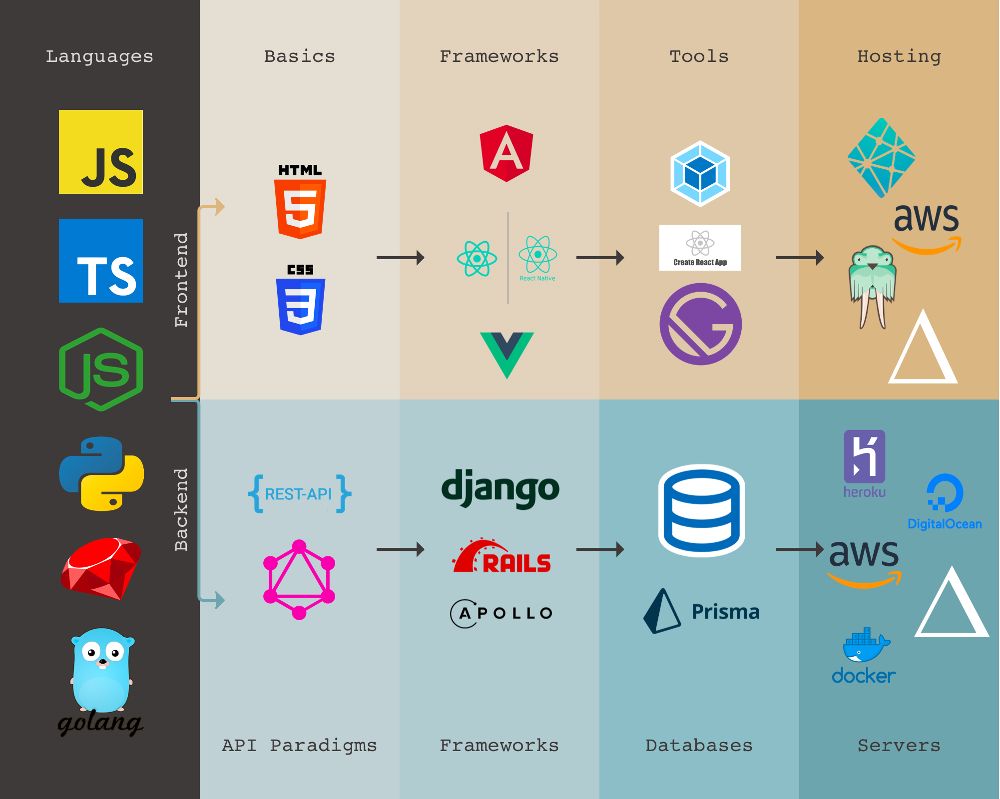

# Learning Pathways for Developers in 2018

**Date**:
11-30-2018

**Details:**
Kick off meeting for FullStack Cafe. We talk about best practices, tools and different learning pathways for a developer in 2018.

## Resources

- Learning pathway image
  

## Speaker Info

Rohit Ravikoti (Co-Founder and CTO of Novvum)

- [Github](http://www.github.com/rohit-ravikoti)

## Misc Info

- Join our [Facebook Group](https://www.facebook.com/groups/FullStackCafe)
